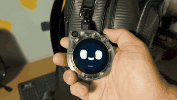

# Bopi: Your DIY Backpack Pet

A voice agent companion running on [SenseCAP Watcher](https://www.seeedstudio.com/SenseCAP-Watcher-W1-A-p-5979.html), powered by [LiveKit](https://livekit.io) and [Dasai](https://dasai.co) animations.

Talk to it, and it reacts with expressions on screen.

**Quick links**:

- [**Build It Yourself**](#what-you-need)
- [**How It Works**](#how-it-works)

## What You Need

- SenseCAP Watcher: [Buy here - $69 - Coupon: 5EB420ZS](https://www.seeedstudio.com/SenseCAP-Watcher-W1-A-p-5979.html?sensecap_affiliate=3gToNR2&referring_service=link)
- A microSD card (any size, FAT32 formatted)
- A USB-C cable
- A computer with [ESP-IDF](https://docs.espressif.com/projects/esp-idf/en/stable/esp32s3/get-started/) v5.4+ installed
- A [LiveKit Cloud](https://cloud.livekit.io) project (or self-hosted server)
- The [LiveKit CLI](https://docs.livekit.io/home/cli/cli-setup/) (`lk`)

❤️ **If you want to buy a SenseCAP Watcher, consider using the link or coupon above.** It's an affiliate link so I'll get a small percentage of your order as appreciation ^^

## Step 1: Prepare the SD Card

1. Format your microSD card as **FAT32**
2. Copy all the `.gif` files from the `sd_content/` folder onto the root of the SD card
3. Insert the SD card into your Watcher

There are 63 animations included plus a `blank.gif` that shows between expressions. You can add your own GIFs too - just drop any `.gif` file onto the SD card root.

## Step 2: Configure

Settings can be set through `idf.py menuconfig` or added directly to `sdkconfig`:

### Credentials

**Option A** - Use a LiveKit Sandbox for quick setup. Create one from your [Cloud Project](https://cloud.livekit.io/projects/p_/sandbox):

```ini
CONFIG_LK_BOPI_USE_SANDBOX=y
CONFIG_LK_BOPI_SANDBOX_ID="my-project-xxxxxx"
```

**Option B** - Use a pre-generated token and server URL:

```ini
CONFIG_LK_BOPI_USE_PREGENERATED=y
CONFIG_LK_BOPI_SERVER_URL="wss://your-project.livekit.cloud"
CONFIG_LK_BOPI_TOKEN="<your-token>"
```

To generate a token with the LiveKit CLI:

```sh
lk token create --project \
    --join --room bopi --agent "bopi-agent" --identity bopi \
    --valid-for 24h
```

This creates a token that joins the room `bopi`, dispatches the agent named `bopi-agent`, and identifies the Watcher as `bopi`.

### Network

WiFi:

```ini
CONFIG_LK_EXAMPLE_USE_WIFI=y
CONFIG_LK_EXAMPLE_WIFI_SSID="<your SSID>"
CONFIG_LK_EXAMPLE_WIFI_PASSWORD="<your password>"
```

> Note: WiFi and Ethernet settings come from the LiveKit `example_utils` component, so they still use the `LK_EXAMPLE_` prefix.

## Step 3: Run the Agent

The `agent/` folder contains a LiveKit Agents server that powers Bopi's voice and expressions. You need [uv](https://docs.astral.sh/uv/) and a `.env.local` file with your API keys.

Generate your `.env.local` credentials:

```sh
cd agent
lk app env -w
```

Then start the agent:

```sh
cd agent
uv sync
uv run bopi-agent dev
```

The agent will connect to your LiveKit project and wait for the Watcher to join the room.

## Step 4: Build and Flash the Firmware

```sh
idf.py build
idf.py flash monitor
```

Press `Ctrl+]` to exit the monitor.

## How It Works

Bopi is built on top of [LiveKit's ESP32 SDK](https://github.com/livekit/client-sdk-esp32), which handles real-time audio streaming over WebRTC directly on the microcontroller. The Watcher connects to a LiveKit room, publishes its microphone audio, and subscribes to audio from the agent - all running on the ESP32-S3.

On the server side, a [LiveKit Agent](https://docs.livekit.io/agents/) (`agent/`) listens to the room. It uses speech-to-text, an LLM, and text-to-speech to hold a conversation. The agent's responses are streamed back to the Watcher as audio, and its transcription is sent as a data stream so the Watcher can react to individual words in real time.

Here's what to expect when using it:

1. **Tap the screen** - the Watcher connects to the LiveKit room and the agent is dispatched
2. **Start talking** - the agent hears you, thinks, and talks back through the speaker
3. **Watch the expressions** - as the agent speaks, matching animations play on screen
4. **Tap again** to mute/unmute the mic
5. **Long-press** to disconnect and restart

The expressions work through the agent's transcription data stream (`lk.transcription`). As the agent speaks, each word is checked against the GIF filenames on the SD card. If a word matches, that animation plays on screen. For example, if the agent says "happy", `happy.gif` plays. If no GIF matches, the word is shown as text instead. The matching is case-insensitive and strips trailing punctuation, so "Happy!" still triggers `happy.gif`. Only single words are matched to keep things snappy.

|                                |                                    |                                |                                  |                                        |
| :----------------------------: | :--------------------------------: | :----------------------------: | :------------------------------: | :------------------------------------: |
|  |  |    |  |  |
|             happy              |              dancing               |              love              |              sleepy              |               surprised                |
|  |  |  |      |            |
|             devil              |              sparkle               |             sushi              |               rain               |                  wink                  |

Between expressions, a `blank.gif` idle animation is shown.

## License

The firmware source code is licensed under the [Apache License 2.0](LICENSE).

The GIF animations in `sd_content/` are property of [Dasai](https://dasai.co) and are included here for personal use with the Bopi project. All rights to the animations belong to Dasai.
